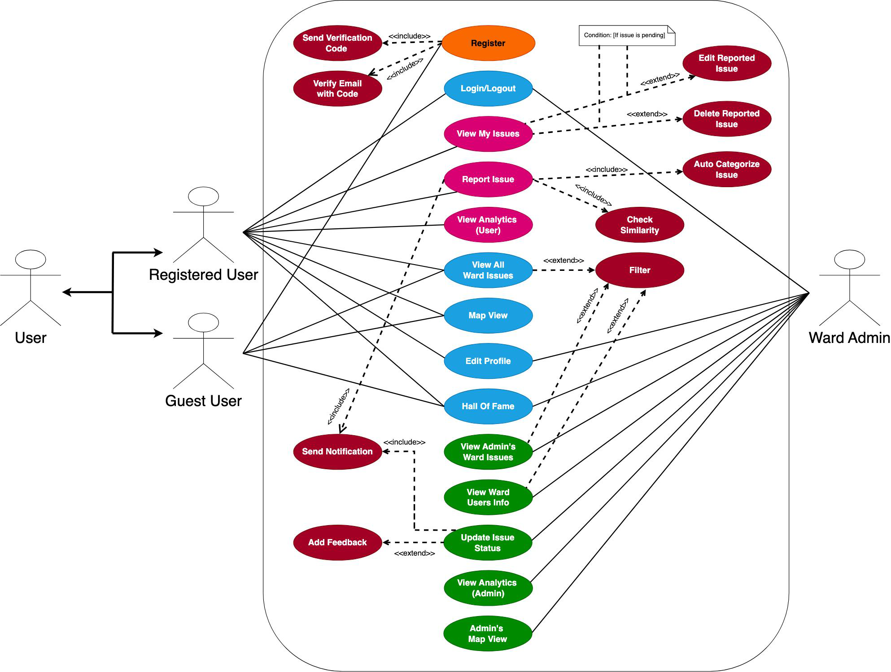
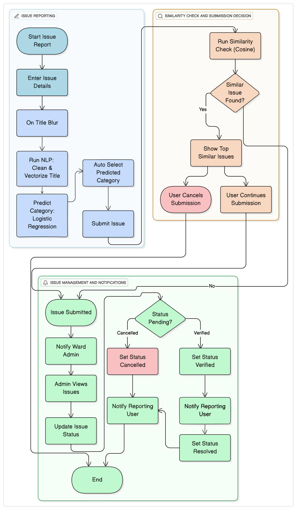

# 🏙️ UrbanFix: An Intelligent E-Governance System for Civic Issue Management

> A full-stack web-based platform to empower citizens to report urban issues to local governments. Built using React, Node.js, MongoDB, and Flask-powered ML microservice. Developed as part of the B.Sc. CSIT Final Year Project at CCT Dharan.


---

## 📽️ Preview: Landing Page

https://github.com/user-attachments/assets/14404b63-941b-4da8-ad06-f9001f2ae69c

---

## 📌 Features

- 🚀 Report civic issues with title, description, image, ward, category, and map location.
- 🧠 ML-based category suggestion using SpaCy + Logistic Regression.
- 🧭 Intelligent duplicate detection using OpenAI embeddings + Cosine Similarity.
- 🧑‍💼 Admin dashboard for verifying issues and updating statuses.
- 📊 Real-time statistics and issue analytics.
- 🧾 Role-based access: Guests, Users, Ward Admins.
- 🗺️ Map view for verified issues (Leaflet.js).

---

## 🧠 Algorithms & Intelligence

### 1. 🔁 Cosine Similarity + Blocking for Duplicate Detection
- Uses OpenAI’s `text-embedding-3-large` model for semantic similarity.
- Blocks comparison scope by **ward + category** for performance.
- Prompts user if similarity ≥ 70% to reduce redundancy.

---

## 📽️ Preview: Cosine Similarity for Duplicate Detection

https://github.com/user-attachments/assets/2e12c3fa-390d-44ba-ac5c-4cf08a5c9c2b

---


### 2. 🏷️ Multi-Label Classification (Category Prediction)
- Titles vectorized using **SpaCy’s `en_core_web_lg` model**.
- Logistic Regression classifier predicts category onBlur.
- Enhances admin efficiency and user experience.

---

## 📽️ Preview: Multi-Label Classification (Category Prediction)

https://github.com/user-attachments/assets/e7fb4105-5b31-4ae5-9b5e-fc08040e725e

---

## 🧩 Tech Stack

| Layer       | Tools Used                                    |
|-------------|-----------------------------------------------|
| Frontend    | React.js, Tailwind CSS, Axios, Leaflet.js     |
| Backend     | Node.js, Express.js, MongoDB, JWT, Bcrypt     |
| ML Service  | Flask, Python, SpaCy, Logistic Regression     |
| Dev Tools   | Postman, GitHub, Cloudinary, OpenAI API       |

---

## 📋 System Architecture

- **Monolithic Architecture** with microservice integration for ML tasks.
- RESTful API communication between client and backend.
- ML service isolated in a Flask container, triggered asynchronously on issue creation.

---

## 🛠️ System Design 

### 🧩 Use Case Diagram


### 🧭 System Flowchart  


---

### 🎬 Video Demo & Other Previews
<details>
<summary>Click to expand</summary>

### User Dashboard
https://github.com/user-attachments/assets/0efb6bc0-e273-46e5-9c9b-603aafac0736

### All Issues View
https://github.com/user-attachments/assets/5e4269d0-9958-4736-a142-47e2218f25fe

### Map View
https://github.com/user-attachments/assets/57cac05c-0138-4fdb-b4c6-dc42a2381eeb

### Analytics View
https://github.com/user-attachments/assets/d282c992-4ef0-40ed-99f0-29b8906673c7

### Verification Panel
https://github.com/user-attachments/assets/fccac6fc-df81-40fa-ab4c-0fc84e579804

### Hall of Fame
https://github.com/user-attachments/assets/b70b7a4b-e73b-4052-adf8-4d755d42ec96

</details>

---

## 📊 Brief Requirement Analysis

### Functional
- User Authentication & Role-based Authorization
- Civic Issue Reporting & Verification
- Real-time Status Tracking & Map Visualization

### Non-Functional
- 🔐 Secure (JWT, Bcrypt)
- ⚡ Performant (OpenAI API, Blocking Strategy)
- 🔧 Scalable, Transparent, Usable

---

## 📁 Repository Structure

```bash
UrbanFix/
├── frontend/               # React Frontend
├── backend/                # Node.js Backend 
├── flask-microservice/     # Flask API
├── assets/                 # System design diagrams 
├── .gitignore
├── Project_Proposal.pdf
└── README.md

